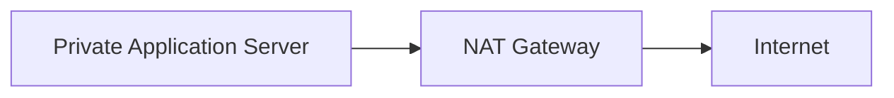
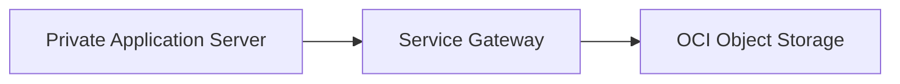

# OCI Gateways

## Overview

Gateways connect a Virtual Cloud Network to destinations outside its private network boundary.

The correct gateway depends on where the traffic needs to go. This may include the public internet, supported OCI services, an on-premises network, or another VCN.

OCI provides four commonly used gateway types:

* Internet Gateway
* NAT Gateway
* Service Gateway
* Dynamic Routing Gateway

---

## Why Gateways Matter

Resources within a VCN are isolated by default. A gateway creates a controlled connection between the VCN and another network or service.

However, creating a gateway alone does not establish connectivity. The subnet must also have:

* A route rule directing traffic to the gateway
* Appropriate Security List or Network Security Group rules
* A public IP address when required
* A valid return path for response traffic

These controls work together to determine whether a connection is allowed.

---

## Internet Gateway

An Internet Gateway supports communication between a VCN and the public internet.

It is commonly used for resources in public subnets, such as:

* Public load balancers
* Bastion hosts
* Public web servers
* Internet-facing services

A resource requires a public IP address, an appropriate route rule, and security rules before it can communicate through the Internet Gateway.

Example route:

```text
Destination: 0.0.0.0/0
Target:      Internet Gateway
```

### Example Use Case

A user accesses a public application through an internet-facing load balancer.


---

## NAT Gateway

A NAT Gateway allows resources without public IP addresses to initiate outbound internet connections.

It is commonly used by resources in private subnets for activities such as:

* Downloading software updates
* Accessing external APIs
* Retrieving application packages
* Installing security patches

The internet cannot use the NAT Gateway to initiate a new inbound connection to a private resource.

Example route:

```text
Destination: 0.0.0.0/0
Target:      NAT Gateway
```

### Example Use Case

A private application server downloads an operating system update.



---

## Service Gateway

A Service Gateway provides private access from a VCN to supported OCI services without requiring public IP addresses or an Internet Gateway.

A common example is access to OCI Object Storage.

Benefits include:

* Traffic remains within the Oracle network
* Private resources do not require public IP addresses
* Internet exposure is reduced
* Access can be controlled through routing and security policies

The route rule uses an OCI service destination rather than a public CIDR range.

Example:

```text
Destination: All services in Oracle Services Network
Target:      Service Gateway
```

### Example Use Case

A private application server sends backup files to OCI Object Storage.



---

## Dynamic Routing Gateway

A Dynamic Routing Gateway, or DRG, is a virtual router that supports private connectivity between a VCN and external private networks.

It is commonly used for:

* Site-to-Site VPN connections
* OCI FastConnect
* Remote VCN peering
* Hub-and-spoke network designs

### Example Use Case

An on-premises application connects privately to resources in OCI.


---

## Gateway Selection Guide

| Connectivity requirement                        | Recommended gateway     |
| ----------------------------------------------- | ----------------------- |
| Public inbound and outbound internet access     | Internet Gateway        |
| Outbound internet access from private resources | NAT Gateway             |
| Private access to supported OCI services        | Service Gateway         |
| Private connectivity to on-premises networks    | Dynamic Routing Gateway |
| Remote VCN peering through a routing hub        | Dynamic Routing Gateway |

---

## Recommended Practices

* Use an Internet Gateway only for resources that require public connectivity.
* Use a NAT Gateway for outbound internet access from private subnets.
* Use a Service Gateway when private workloads access supported OCI services.
* Use a DRG for hybrid or private network connectivity.
* Confirm both forward and return routes.
* Apply only the security rules required by the application.
* Review gateway and route configurations regularly.

---

## Key Learning Outcome

Each OCI gateway addresses a different connectivity requirement.

The key point is to select the gateway based on the destination and the level of exposure required. Routing and security rules must then be aligned with that gateway to provide controlled connectivity.

