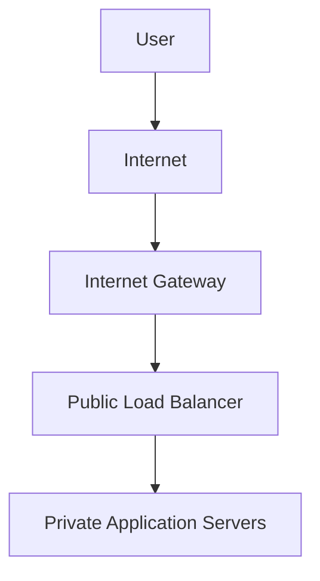

# Routing and Traffic Flow in OCI

## Overview

Routing determines how network traffic moves within a Virtual Cloud Network and reaches external destinations.

OCI uses route tables to define the path that traffic should follow. A properly designed route table sends traffic to the correct destination while avoiding unnecessary network exposure.

---

## Route Tables

A route table contains route rules. Each rule identifies:

* **Destination:** The network or service the traffic needs to reach
* **Target:** The gateway or network resource that should receive the traffic

A route table is associated with one or more subnets.

When traffic leaves a subnet, OCI evaluates the relevant route rules and selects the most specific matching destination.

---

## Example Route Rules

### Public Internet Access

```text
Destination: 0.0.0.0/0
Target:      Internet Gateway
```

This rule directs IPv4 traffic without a more specific route toward the Internet Gateway.

It is commonly associated with a public subnet.

### Private Outbound Internet Access

```text
Destination: 0.0.0.0/0
Target:      NAT Gateway
```

This rule allows resources in a private subnet to initiate outbound internet connections without using public IP addresses.

### On-Premises Connectivity

```text
Destination: 192.168.0.0/16
Target:      Dynamic Routing Gateway
```

This rule sends traffic intended for the specified on-premises network to the DRG.

---

## Traffic Flow Example

A typical application design uses a public load balancer and private application servers.



In this flow:

1. The user sends a request through the internet.
2. The Internet Gateway provides connectivity to the VCN.
3. The public load balancer receives the approved request.
4. The load balancer forwards the request to an application server.
5. Security rules determine whether each connection is permitted.

The application servers remain protected from direct internet access.

---

## Internal VCN Traffic

Resources within the same VCN normally communicate through private IP addresses.

Example:

```text
Application Server → Database Server
```

This communication remains within the OCI private network and does not require an Internet Gateway or NAT Gateway.

Security Lists and Network Security Groups must still permit the required traffic.

---

## Route Selection

OCI evaluates available routes based on the destination address.

When multiple routes could apply, the most specific matching route is selected.

For example:

```text
0.0.0.0/0       → NAT Gateway
192.168.0.0/16  → Dynamic Routing Gateway
```

Traffic for `192.168.0.0/16` follows the more specific DRG route. Other internet-bound traffic follows the default route to the NAT Gateway.

---

## Routing and Security

A valid route does not automatically permit communication.

Successful traffic flow normally requires:

* A route to the destination
* A valid return route
* Security rules permitting the traffic
* A correctly configured gateway
* Appropriate public or private IP addressing
* A service listening on the destination port

This distinction is important: route tables determine the path, while security rules determine whether the traffic is allowed.

---

## Recommended Practices

* Create separate route tables when subnets have different connectivity requirements.
* Send public-subnet internet traffic through an Internet Gateway.
* Send private-subnet internet traffic through a NAT Gateway.
* Use a Service Gateway for supported OCI services when appropriate.
* Route private external networks through a DRG.
* Avoid adding routes that are broader than required.
* Confirm the return path when troubleshooting connectivity.
* Review routes and security rules together.

---

## Key Learning Outcome

Routing controls the path followed by network traffic.

The key point is that connectivity depends on more than a route rule. The route, gateway, return path, IP configuration, and security rules must all support the intended communication.

