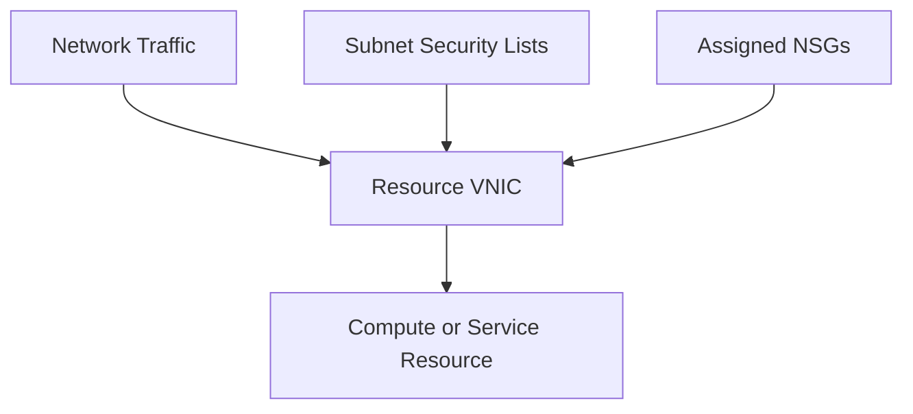

# Security Lists vs Network Security Groups

## Overview

OCI provides two main controls for managing network traffic:

* Security Lists
* Network Security Groups

Both operate as virtual firewalls, but they are applied at different levels.

Security Lists apply to every VNIC in a subnet. Network Security Groups apply only to VNICs that have been added to the group.

---

## Why Network Security Controls Matter

Route tables determine where traffic travels, but they do not decide whether the traffic should be permitted.

Security Lists and Network Security Groups control:

* Traffic entering a resource
* Traffic leaving a resource
* Permitted protocols
* Source and destination ranges
* Approved ports
* Stateful or stateless traffic handling

Only the access required by the application should be allowed.

---

## Security Lists

A Security List is associated with a subnet.

Its rules apply to all VNICs within that subnet. This makes Security Lists useful for common rules that should apply across the complete subnet.

Typical examples include:

* Standard internal communication
* Common administrative access
* Basic subnet-wide traffic controls

### Example Rule

Allow SSH access from an approved corporate network:

```text
Direction:  Ingress
Source:     203.0.113.0/24
Protocol:   TCP
Port:       22
```

The source range should be replaced with the actual approved network.

Allowing SSH from `0.0.0.0/0` should generally be avoided because it exposes the port to the entire internet.

---

## Network Security Groups

A Network Security Group, or NSG, applies rules to selected VNICs rather than an entire subnet.

NSGs are useful when resources within the same subnet perform different roles.

For example:

* A load-balancer NSG allows HTTPS traffic from users.
* An application NSG allows traffic only from the load balancer.
* A database NSG allows database traffic only from application servers.

Benefits include:

* Resource-specific security
* Clearer application-layer separation
* Easier rule management
* Reduced dependency on subnet structure
* Reusable security policies

---

## How the Controls Apply

Security Lists and NSGs are not arranged as one firewall after another. Both sets of applicable rules are evaluated for a resource’s VNIC.



If a VNIC belongs to one or more NSGs, the applicable Security List and NSG rules work together. A permitted rule can come from either control.

Because the effective rules are combined, adding an NSG does not override a broad Security List rule. Existing Security List rules should therefore be reviewed before using NSGs to tighten access.

---

## Security Lists and NSGs Compared

| Area                   | Security List             | Network Security Group        |
| ---------------------- | ------------------------- | ----------------------------- |
| Applied to             | Entire subnet             | Selected VNICs                |
| Level of control       | Subnet level              | Resource or application level |
| Best suited for        | Common subnet rules       | Workload-specific rules       |
| Membership             | Automatic based on subnet | Explicitly assigned           |
| Flexibility            | Lower                     | Higher                        |
| Application separation | Limited                   | Stronger                      |

---

## Stateful and Stateless Rules

Both Security Lists and NSGs support stateful and stateless rules.

### Stateful Rules

Stateful rules automatically allow response traffic for an approved connection.

They are suitable for most standard application traffic.

### Stateless Rules

Stateless rules evaluate inbound and outbound traffic separately.

They may be used for specialized use cases requiring greater control, but corresponding rules must be configured in both directions.

---

## Recommended Design

A practical security model is:

* Use Security Lists for essential subnet-level controls.
* Use NSGs for application-specific security rules.
* Keep broad subnet rules to a minimum.
* Group resources according to their application roles.
* Allow traffic only from approved sources.
* Avoid unrestricted administrative access.
* Review the combined effect of Security Lists and NSGs.

Example application controls:

```text
Internet → Load Balancer: Allow HTTPS on TCP port 443
Load Balancer → Application: Allow the application port
Application → Database: Allow only the required database port
```

---

## Key Learning Outcome

Security Lists provide subnet-wide control, while NSGs provide more specific control over selected resources.

The key point is that these controls are combined, not sequential. NSGs provide greater flexibility, but they cannot cancel access already permitted by a broad Security List rule. Both must therefore be designed and reviewed as one security model.

