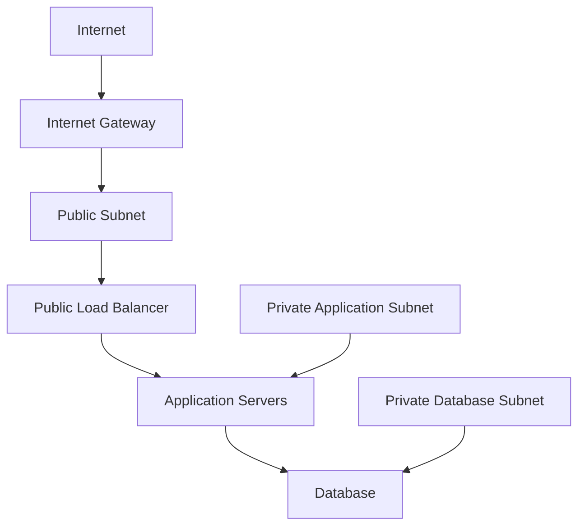

# Subnet Design in OCI

## Overview

A subnet divides a Virtual Cloud Network into smaller network segments. It provides a controlled area where OCI resources such as compute instances, load balancers, and databases can be deployed.
The main purpose of subnet design is to separate resources based on their access and security requirements.
For example, a load balancer may need to receive traffic from the internet, while an application server or database should remain protected from direct public access. Placing these resources in different subnets creates this separation and makes the network easier to control.
---

## Why Subnet Design Matters

Subnet design affects how securely and efficiently an OCI environment operates.
A well-designed subnet structure helps organizations:

* Separate public and private resources
* Reduce direct internet exposure
* Control how traffic moves between application layers
* Apply routing and security policies
* Isolate sensitive workloads
* Support future application growth

The objective is not simply to create multiple subnets. Each subnet should have a clear purpose based on the resources it contains and the connectivity those resources require.
---
## Types of Subnets
OCI provides two subnet access types:
* Public subnets
* Private subnets
The main difference is whether resources within the subnet can be assigned public IP addresses.
---

## Public Subnet
A public subnet allows resources to receive public IP addresses.
It is commonly used for resources that need to receive traffic from the internet, such as:
* Public load balancers
* Bastion hosts
* Public-facing web servers
* Internet-facing services
However, placing a resource in a public subnet does not automatically make it accessible from the internet.
Internet connectivity also requires:
* An Internet Gateway
* A route rule directing traffic to the Internet Gateway
* A public IP address assigned to the resource
* Security rules permitting the required traffic
Each of these controls must be configured correctly before external communication is allowed.
---
## Private Subnet
A private subnet does not allow public IP addresses to be assigned to its resources.
It is normally used for workloads that should remain protected from direct internet access, such as:
* Application servers
* Databases
* Internal services
* Backend processing systems
Resources in a private subnet can still initiate outbound internet connections through a NAT Gateway when required.
For example, an application server may need outbound access to download operating system updates. A NAT Gateway supports this connection without allowing the internet to initiate a direct connection back to the server.
Private resources can also access supported OCI services through a Service Gateway without sending traffic across the public internet.
---
## Subnet Architecture
A common OCI design separates the application into public, application, and database layers.

In this design:

* The public load balancer receives approved internet traffic.
* Application servers operate within a private subnet.
* The database is placed in a separate private subnet.
* Only the required traffic is permitted between each layer.
This structure limits exposure and creates clear security boundaries across the application.

---
## CIDR Planning

Each subnet must use a CIDR range that falls within the VCN CIDR range.

Example:

```text
VCN:                         10.0.0.0/16
Public Subnet:               10.0.1.0/24
Private Application Subnet: 10.0.2.0/24
Private Database Subnet:    10.0.3.0/24
```

Subnet CIDR ranges must not overlap.
Address ranges should also provide enough capacity for current resources and reasonable future growth. Changing the network design later can become difficult when multiple applications and integrations already depend on the existing IP ranges.
---

## Regional and Availability Domain-Specific Subnets
OCI supports two subnet scope options:

### Regional Subnet
A regional subnet can contain resources across all Availability Domains within an OCI region.
Regional subnets are generally preferred because they provide greater flexibility and make it easier to design highly available applications.

### Availability Domain-Specific Subnet
An Availability Domain-specific subnet is limited to one Availability Domain.
This option may be used when a workload has a specific architectural requirement, but it provides less deployment flexibility than a regional subnet.
For most new designs, regional subnets should be considered first.

---

## Security Controls

Subnet traffic can be controlled using:

* Route Tables
* Security Lists
* Network Security Groups
* Internet Gateways
* NAT Gateways
* Service Gateways

Security Lists apply rules at the subnet level, while Network Security Groups apply rules to selected resources.
A good design uses only the access required for the application to operate. Broad inbound rules should be avoided, particularly for private application and database subnets.

---

## Recommended Design Practices

The following practices support a secure and manageable subnet design:

* Use public subnets only for resources that require public connectivity.
* Keep application servers and databases in private subnets.
* Separate application and database workloads where stronger isolation is required.
* Prefer regional subnets unless there is a specific reason to use an Availability Domain-specific subnet.
* Plan CIDR ranges before deploying resources.
* Allow only the traffic required between application layers.
* Use a NAT Gateway for controlled outbound internet access from private subnets.
* Use a Service Gateway for private access to supported OCI services.
* Review route tables and security rules regularly.
* Avoid placing sensitive workloads directly in public subnets.

---

## Key Learning Outcome

Subnet design creates the security boundaries within a VCN.
Public subnets support resources that require controlled public connectivity. Private subnets protect internal application and database workloads from direct internet access.
The key point is to design each subnet around the role of its resources. When public, application, and database workloads are properly separated, the environment becomes more secure, easier to manage, and better prepared for future growth.

