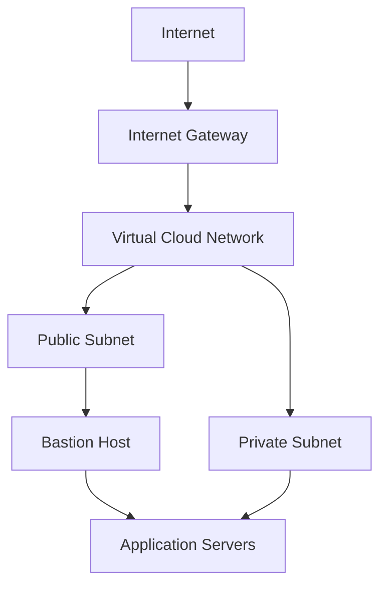

# Virtual Cloud Network (VCN)

## Overview

A Virtual Cloud Network, or VCN, is the foundation of networking in Oracle Cloud Infrastructure.

It is a logically isolated network where OCI resources such as compute instances, load balancers, and databases can communicate securely. A VCN works similarly to a traditional on-premises network, but it is created and managed within OCI.

A well-designed VCN provides:

* Private IP addressing
* Network segmentation
* Secure communication between resources
* Controlled inbound and outbound connectivity
* Connectivity between OCI and on-premises networks

---

## Why a VCN Matters

A VCN establishes the network boundary for cloud resources.

Within this boundary, administrators can control:

* Where resources are deployed
* Which resources can communicate
* How traffic enters and leaves the network
* Which services can access the internet
* How cloud resources connect to on-premises environments

This structure helps reduce unnecessary exposure and supports a secure cloud architecture.

---

## VCN CIDR Block

When creating a VCN, an IP address range must be defined using Classless Inter-Domain Routing, or CIDR, notation.

Example:

```text
10.0.0.0/16
```

In this example:

* `10.0.0.0` identifies the starting network address.
* `/16` identifies the size of the network range.
* The address space can be divided into smaller subnet ranges.

For example:

```text
VCN:             10.0.0.0/16
Public Subnet:   10.0.1.0/24
Private Subnet:  10.0.2.0/24
```

The CIDR range should be planned carefully to prevent address conflicts, particularly when the VCN will connect to another VCN or an on-premises network.

---

## VCN Architecture Flow

A typical VCN separates public-facing resources from protected application workloads.



In this design:

* The Internet Gateway provides controlled internet connectivity.
* The bastion host is placed in the public subnet.
* Application servers are placed in the private subnet.
* The bastion host provides controlled administrative access to private resources.
* Route tables and security rules determine which traffic is permitted.

This separation protects application servers from direct internet exposure.

---

## Key Components Within a VCN

A typical VCN contains the following networking components:

* **Subnets:** Divide the VCN into smaller network segments
* **Route Tables:** Define where network traffic is directed
* **Gateways:** Connect the VCN to external networks and OCI services
* **Security Lists:** Apply traffic rules at the subnet level
* **Network Security Groups:** Apply security rules to selected resources
* **Dynamic Routing Gateways:** Support private connectivity to on-premises networks or other VCNs

These components work together to control connectivity, traffic flow, and network security.

---

## Public and Private Subnets

A VCN can contain both public and private subnets.

### Public Subnet

A public subnet can support resources that require direct internet connectivity.

Common examples include:

* Public load balancers
* Bastion hosts
* Web servers

A resource is not automatically internet-accessible simply because it is placed in a public subnet. The required gateway, route, public IP address, and security rules must also be configured.

### Private Subnet

A private subnet is used for resources that should not be directly accessible from the internet.

Common examples include:

* Application servers
* Databases
* Internal services

Private resources can still access approved external services through controlled networking components such as a NAT Gateway or Service Gateway.

---

## Benefits of a VCN

A properly designed VCN allows organizations to:

* Isolate cloud workloads
* Separate public and private resources
* Control inbound and outbound traffic
* Apply security rules at different levels
* Connect OCI securely to on-premises networks
* Support future application and infrastructure growth

---

## Key Learning Outcome

A VCN provides the network foundation for OCI resources. Its CIDR ranges, subnets, routing rules, gateways, and security controls determine how resources communicate and how securely the environment operates.

The key point is that creating a VCN is only the starting point. The security and scalability of the network depend on how its supporting components are designed and managed.
