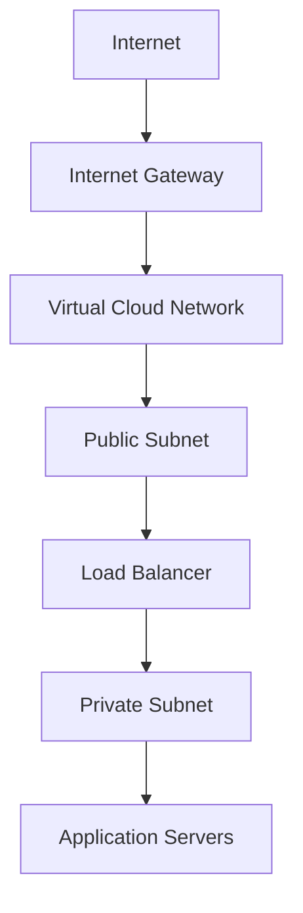

# OCI Networking Analysis

## Overview

Networking is one of the key foundations of any cloud environment. A well-designed network helps applications communicate securely while keeping workloads isolated and controlled.

Oracle Cloud Infrastructure provides a flexible networking model that supports both simple and enterprise-level cloud architectures.

This repository explains the core OCI networking components, how they work together, and why each component matters when building secure and scalable cloud infrastructure.

---

## Purpose of This Repository

The purpose of this project is to provide a clear and practical understanding of OCI networking.

The documentation focuses on three areas:

* How OCI networking components are structured
* How network traffic is routed and controlled
* How cloud workloads can be protected using security controls

The goal is not only to explain each component individually, but also to show how they work together as part of one complete network design.

---

## Core Networking Components

OCI networking is built using the following core components:

* **Virtual Cloud Network:** Provides an isolated network environment for OCI resources
* **Subnets:** Organize resources into public or private network segments
* **Route Tables:** Define how traffic moves between network destinations
* **Gateways:** Connect the VCN to the internet, private services, or external networks
* **Security Lists:** Apply subnet-level traffic rules
* **Network Security Groups:** Apply security rules to selected resources

Together, these components determine how traffic enters, leaves, and moves within the cloud environment.

---

## OCI Networking Architecture

A typical OCI architecture separates public-facing services from internal application workloads.



In this design:

* The Internet Gateway provides external connectivity.
* The public subnet hosts resources that require controlled internet access.
* The load balancer receives and distributes incoming traffic.
* Application servers remain protected within the private subnet.
* Route tables and security rules control the permitted traffic flow.

This separation reduces unnecessary exposure while allowing applications to remain accessible.

---

## Topics Covered

This repository covers the following OCI networking concepts:

* VCN architecture and design
* Public and private subnet strategies
* OCI gateway types and their roles
* Route tables and traffic routing
* Security Lists and Network Security Groups
* Secure network traffic flow

Each topic is explained separately in the `docs` folder.

---

## Key Learning Outcomes

After reviewing this repository, readers should be able to:

* Explain the purpose of a VCN
* Understand the difference between public and private subnets
* Select the appropriate OCI gateway for a networking requirement
* Explain how route tables control traffic flow
* Compare Security Lists and Network Security Groups
* Understand how OCI networking components work together
* Design a basic, secure, and scalable OCI network architecture

---

## Repository Structure

```text
oci-networking-Analysis/
├── README.md
└── Documents/
    ├── vcn-overview.md
    ├── subnet-design.md
    ├── gateways.md
    ├── security-lists-vs-nsg.md
    └── routing-and-traffic-flow.md
```


