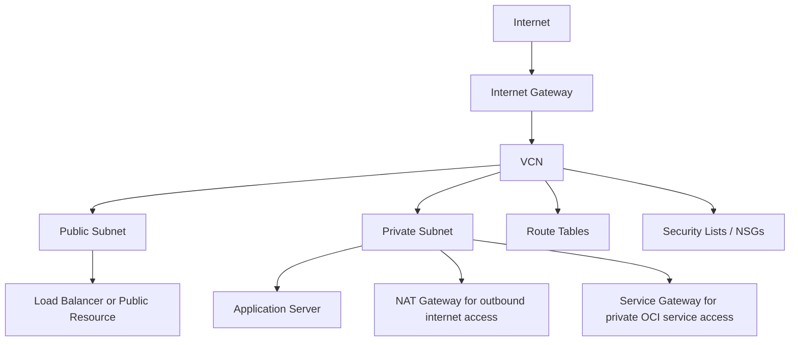

# OCI Networking Analysis

## Overview

I created this repository as part of my Oracle ACE Apprentice learning journey to document my understanding of Oracle Cloud Infrastructure networking.
The focus of this repository is to explain OCI networking components in a simple and practical way. I wanted to understand how VCNs, subnets, gateways, route tables, security lists, and network security groups work together to control traffic flow in OCI.
This is not official Oracle documentation. These are my own learning notes, examples, and observations based on my practice and study of OCI networking.

---

## Why I Created This

Networking is one of the first areas to understand before deploying workloads in the cloud.
In OCI, the network design decides how resources communicate, how internet access is controlled, and how private workloads are protected. As part of my learning, I wanted to break this down into small topics so that another learner can follow the same flow.

---

## Product Used

Oracle Cloud Infrastructure Networking

---

## Topics Covered

This repository covers:

- Virtual Cloud Network
- Public and private subnets
- Route tables
- Internet Gateway
- NAT Gateway
- Service Gateway
- Dynamic Routing Gateway
- Security Lists
- Network Security Groups
- Basic traffic flow in OCI

---

## Simple Architecture Flow

This is a simple learning example. In a real implementation, the design may change based on security, application, integration, and business requirements.

---

## Documentation

- [VCN Overview](documents/vcn-overview.md)
- [Subnet Design](docs/subnet-design.md)
- [OCI Gateways](docs/gateways.md)
- [Routing and Traffic Flow](docs/routing-and-traffic-flow.md)
- [Security Lists vs Network Security Groups](docs/security-lists-vs-nsg.md)

---

## What I Learned

The key learning from this exercise is that OCI networking is not only about creating a VCN or subnet.
A proper network design depends on how routing, gateways, and security controls are configured together. A subnet may be public or private, but traffic behavior is controlled through route tables, gateways, security lists, and network security groups.
This helped me understand OCI networking from a traffic-flow and design perspective.

---

## Confidentiality Note
All examples in this repository are based on my own learning and documentation. No client-confidential, proprietary, or project-specific information is included.

---

## Oracle ACE Apprentice Note

I created this repository after being accepted into the Oracle ACE Apprentice Program as part of my product usage learning and contribution journey.
